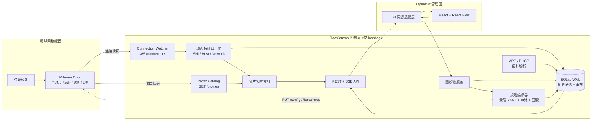
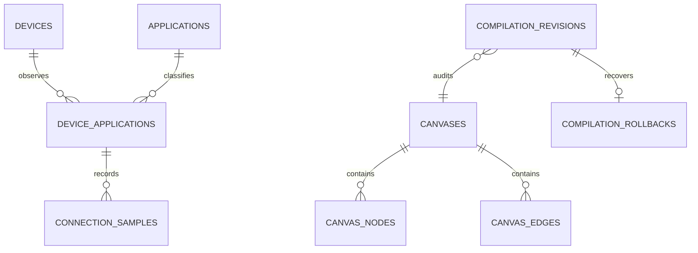

# luci-app-flowcanvas

> 面向 Mihomo 旁路由的**可视化意图驱动网络编排面板**。通过真实连接元数据形成“终端 → 动态应用流 → 出口”的可编辑画布，而非依赖静态 geosite/geoip 规则库。

**当前状态：第三阶段完成。** FlowCanvas 已将 Mihomo WebSocket 实时发现、SQLite 历史记忆、严格三段式画布、规则预览、Mihomo 热重载与失败回滚接成可审计闭环。LuCI 打包与 GitHub Actions `.ipk` 发布将在第四阶段实现。

| 能力 | 第三阶段状态 | 说明 |
|---|---|---|
| Go 控制面 | 已接入实时同步 | 同机 REST/SSE 服务、生命周期管理和数据库崩溃恢复。 |
| SQLite 历史记忆 | 已运行 | 连接样本按 `connection_id` 入库；断连仅标记关闭并保留历史。 |
| Mihomo 连接模型 | 已运行 | `WS /connections` 快照差分、Host/SNI 归一化、TCP/UDP/QUIC 特征入库。 |
| ARP / DHCP 终端发现 | 已运行 | 定期解析 `/proc/net/arp` 与 dnsmasq lease，合并 MAC/Hostname。 |
| Mihomo 出口目录 | 已运行 | 定期读取 `/proxies` 并实时生成 Target 节点状态。 |
| React Flow 画布 | 已接入真实目录 | 支持保存、规则预览、显式确认应用和回滚状态展示。 |
| Graph → Mihomo YAML | 已运行 | 按 Target 生成 inline classical provider，编译为 `SRC-IP-CIDR + DOMAIN*` 逻辑规则。 |
| Mihomo 热重载与回滚 | 已运行 | 原子备份和写入，`PUT /configs?force=true`，失败时恢复主配置并重载。 |
| LuCI `.ipk` 包与 CI 发布 | 预留 | 第四阶段实现。 |

## 设计原则

FlowCanvas **不会自行抓包、解密流量或读取请求正文**。它订阅 Mihomo 的 `WS /connections` 连接快照，并消费 Mihomo 已归一化的连接元数据。Mihomo 的连接 API 提供活动连接、连接元数据、流量统计、命中规则和代理链信息；`/proxies` 提供当前出口及其运行状态。[1] 这样既避免重复部署 L7 检测链路，也保证前端显示的是内核实际已经识别到的终端与 Host/SNI。

Mihomo 内置嗅探器目前支持 HTTP、TLS 和 QUIC；为减少纯 IP 流量漏识别，推荐启用 `sniffer.enable` 与 `parse-pure-ip`。[2] FlowCanvas 只在 `sniffHost` 或 `host` 存在可用域名时生成 Filter 节点，绝不根据目的 IP 反向臆测域名。

## 架构



> Mihomo 路由规则按由上至下的顺序匹配；逻辑组合规则使用 `LOGIC_TYPE,((payload1),(payload2)),Proxy` 形式。[3] FlowCanvas 因而按出口分组生成 inline classical provider，再将受管 `RULE-SET` 插入用户规则之前。仅键名前缀为 `flowcanvas-` 的 provider 和 `RULE-SET` 条目会被管理，用户的其他规则保持不变。

### 实时处理与内存策略

目标是高性能 x86 旁路由，因此设计优先级是低延迟和高并发，而非极限缩小内存。`ConnectionWatcher` 对完整 WebSocket 快照按 `connection.id` 做差分；新出现的连接生成 `observed` 事件，消失的连接生成 `closed` 事件。状态写入使用有界队列、批量 SQLite WAL 事务和独立 SSE 推送队列，防止慢浏览器拖慢嗅探与持久化热路径。

| 模块 | 当前默认策略 | 目的 |
|---|---|---|
| WebSocket 快照 | `250ms` 间隔，可配置 | 及时识别连接生命周期变化。 |
| 事件写入器 | 8,192 条有界队列，按 `connection_id` 合并 | 数据库短暂抖动不会阻塞 WebSocket。 |
| SQLite 写入 | 256 条或 200ms 批量事务 | 提升吞吐并缩短锁持有时间。 |
| SSE 客户端 | 每订阅者 256 条有界队列 | 慢客户端收到 `resync`，不阻塞核心数据流。 |
| ARP/DHCP 刷新 | 30 秒周期 | 将终端名称和 MAC 与真实源 IP 合并。 |
| `/proxies` 刷新 | 10 秒周期 | 显示当前可用出口与 UDP/存活状态。 |

## 严格画布模型

画布中只能形成以下两类边：

```text
Source（终端） ──► Filter（该终端真实嗅探到的 Host/SNI） ──► Target（Mihomo 运行时出口）
```

| 节点 | 稳定标识 | 活跃状态 | 服务端校验 |
|---|---|---|---|
| Source | `source:{device_id}` | ARP/DHCP 在线或有活跃应用流 | 只能连到同一个 `device_id` 的 Filter。 |
| Filter | `filter:{device_application_id}` | 当前 `activeConnections > 0` | 只允许连接 Target。 |
| Target | `target:{hash(proxy_name)}` | Mihomo 目录存在，且显示 `alive` | 不能作为连线源。 |

前端会即时拒绝不合法拖线；后端在 `PUT /api/v1/canvas/graph` 中再次验证，因此无法通过伪造 HTTP 请求跳过约束。保存使用 `If-Match: "canvas-{revision}"` 乐观锁，多标签页并发修改会返回 `409 CANVAS_REVISION_CONFLICT`。

## 数据模型

SQLite 迁移位于 [`backend/migrations/0001_init.sql`](backend/migrations/0001_init.sql)，运行时以嵌入式 schema 初始化。主要实体关系如下：



`applications` 默认将首次观察到的域名设为精确 `DOMAIN` 匹配，避免系统自动把 `v.qq.com` 放大为 `qq.com`。编译器支持数据模型中已确认的 `DOMAIN-SUFFIX` 与 `DOMAIN-KEYWORD`，并在预览中显示实际生成的 payload；Mihomo 的 `DOMAIN-SUFFIX` 按域名后缀匹配，`DOMAIN-KEYWORD` 按关键词匹配。[3]

完整的架构、字段优先级、SQL schema、错误码和 API 示例请参阅 [`docs/architecture.md`](docs/architecture.md)；第二阶段的实时同步状态机请参阅 [`docs/phase-2-realtime-sync.md`](docs/phase-2-realtime-sync.md)，第三阶段的编译、安全合并、回滚状态机与 Mihomo API 依据请参阅 [`docs/phase-3-compiler-design.md`](docs/phase-3-compiler-design.md) 和 [`docs/research/mihomo-config-api.md`](docs/research/mihomo-config-api.md)。

## 仓库结构

```text
.
├── backend/
│   ├── cmd/flowcanvasd/        # Go 守护进程入口
│   ├── internal/api/           # REST、SSE、API 错误封装
│   ├── internal/domain/        # 稳定领域模型与 ID
│   ├── internal/compiler/      # YAML 编译、受管合并、原子应用与回滚
│   ├── internal/graph/         # 三段式图校验
│   ├── internal/mihomo/        # Controller 客户端、WS 模型、快照差分
│   ├── internal/store/         # SQLite WAL、迁移与图事务
│   ├── internal/telemetry/     # 实时画布目录接口
│   ├── internal/topology/      # ARP 和 DHCP lease 解析
│   └── migrations/             # 版本化 SQL 迁移
├── frontend/
│   └── src/                    # React 19 + React Flow 12 画布
├── luci-app-flowcanvas/        # 后续 OpenWrt 打包与 LuCI 资源落点
└── docs/architecture.md        # 第一阶段详细技术契约
```

## 本地开发与验证

### 前置条件

开发机需要 Go 1.22+、Node.js 22+ 和 pnpm。SQLite 通过纯 Go 驱动嵌入守护进程；生产打包阶段会依据 OpenWrt SDK 目标重新评估二进制尺寸、SQLite 依赖和交叉编译策略。

### 启动后端

```bash
cd backend
GOPROXY=https://proxy.golang.org,direct go mod tidy
go test ./...
mkdir -p ../bin
go build -o ../bin/flowcanvasd ./cmd/flowcanvasd

FLOWCANVAS_LISTEN=127.0.0.1:16789 \
FLOWCANVAS_DB=/tmp/flowcanvas/flowcanvas.db \
FLOWCANVAS_DEMO=true \
../bin/flowcanvasd

# 生产模式：显式授予 FlowCanvas 可管理的 Mihomo 主配置和备份目录
FLOWCANVAS_LISTEN=127.0.0.1:16789 \
FLOWCANVAS_DB=/var/lib/flowcanvas/flowcanvas.db \
FLOWCANVAS_MIHOMO_CONTROLLER=http://127.0.0.1:9090 \
FLOWCANVAS_MIHOMO_SECRET='<root-only-secret>' \
FLOWCANVAS_MIHOMO_CONFIG=/etc/mihomo/config.yaml \
FLOWCANVAS_MIHOMO_BACKUP_DIR=/etc/mihomo/.flowcanvas-backups \
../bin/flowcanvasd
```

生产模式默认关闭演示目录，并会连接 `FLOWCANVAS_MIHOMO_CONTROLLER` 指向的 Mihomo 控制器。为避免误改未知配置，生产模式必须显式设置绝对路径 `FLOWCANVAS_MIHOMO_CONFIG`；备份目录默认为其同级的 `.flowcanvas-backups`。开发机在没有 Mihomo 时可显式设置 `FLOWCANVAS_DEMO=true`。当前仍使用环境变量；UCI 配置与 LuCI 安装适配将在打包阶段落地。

### 启动前端

```bash
cd frontend
pnpm install
pnpm build
pnpm dev
```

本地 Vite 开发时如果无法连接 `/api/v1/canvas`，界面会回退到不可持久化的演示快照；生产 LuCI 环境不会使用这个回退逻辑。

### 已验证命令

```bash
cd backend && go test ./...
cd frontend && pnpm build
```

第二阶段额外验证了：模拟 Mihomo WebSocket 发送含真实 Host 的连接快照后，样本先进入 active 状态，随后在空快照中被标记关闭并在画布中显示为 inactive；ARP/DHCP 解析能合并终端名称和 MAC；`/proxies` 能生成 Target；`go test -race ./...` 通过。第三阶段额外验证了：多出口图被按 Target 分组为稳定的 inline classical provider；模拟 `PUT /configs?force=true` 成功后生成候选配置；候选重载失败后原主 YAML 被原子恢复并再次重载；控制面集成测试覆盖预览、If-Match 应用和审计查询。

## v1 API 概览

| 方法 | 路径 | 第三阶段状态 |
|---|---|---|
| `GET` | `/api/v1/health` | 可用。 |
| `GET` | `/api/v1/canvas` | 可用，读取真实 Live Catalog。 |
| `GET` | `/api/v1/canvas/events` | 可用，连接生命周期变化时发布重同步。 |
| `PUT` | `/api/v1/canvas/graph` | 可用，服务端严格校验。 |
| `GET` | `/api/v1/targets` | 可用，读取 Mihomo `/proxies` 运行时目录。 |
| `GET` | `/api/v1/features` | 可用，读取 SQLite 活跃/历史动态应用流。 |
| `POST` | `/api/v1/discovery/refresh` | 可用，立即刷新 ARP/DHCP 与 Mihomo 出口目录。 |
| `POST` | `/api/v1/compilations/validate` | 可用，无副作用编译和审计记录。 |
| `POST` | `/api/v1/compilations/apply` | 可用，需要当前画布 `If-Match`；原子写入、Mihomo 重载和失败回滚。 |
| `GET` | `/api/v1/compilations/{id}` | 可用，读取编译和回滚审计。 |

## 推荐的 Mihomo 前置配置

部署第二阶段实时同步前，请确保 Mihomo 控制器只监听 loopback，并启用内置域名嗅探。`override-destination` 是否打开取决于现有 Fake-IP/TUN 配置，本项目不会自动修改它。

```yaml
external-controller: 127.0.0.1:9090
secret: "<仅由 root 可读的随机字符串>"
sniffer:
  enable: true
  parse-pure-ip: true
  sniff:
    HTTP: { ports: [80, 8080-8880] }
    TLS: { ports: [443, 8443] }
    QUIC: { ports: [443, 8443] }
```

Mihomo 的 `external-controller` 可通过 RESTful API 管理内核，`external-ui` 可承载静态网页资源；生产安装将使用 LuCI 同源适配层而非把 Controller Secret 发送至浏览器。[4]

## 安全与隐私

FlowCanvas 处理的是源 IP、MAC、终端名称、域名特征和出口状态等本地网络元数据。它不上传这些数据，不记录 HTTP 请求体、Cookie、TLS 私钥或明文负载。Mihomo Secret 只应由 root 权限的后端读取；前端应通过 LuCI 已认证会话调用本地 API，而不能直接调用 `127.0.0.1:9090`。

## 路线图

| 阶段 | 重点 | 目标交付 |
|---|---|---|
| 第二阶段 | Mihomo WebSocket、SQLite 状态写入、ARP/DHCP 与 `/proxies` 实时目录 | 已完成：活跃/历史节点的真实数据流。 |
| 第三阶段 | 图→YAML 规则编译和 `/configs?force=true` 热重载 | 已完成：可审计的 `SRC-IP-CIDR + DOMAIN*` 复合规则、原子备份和失败回滚。 |
| 第四阶段 | LuCI 菜单与同源代理、OpenWrt SDK Makefile、安装脚本、GitHub Actions | x86_64 `.ipk` 自动构建与 Release 发布。 |

## 许可证

本项目采用 [MIT License](LICENSE)。

## 参考资料

[1]: https://wiki.metacubex.one/en/api/ "Mihomo 官方 API 文档"
[2]: https://wiki.metacubex.one/en/config/sniff/ "Mihomo 官方域名嗅探配置"
[3]: https://wiki.metacubex.one/en/config/rules/ "Mihomo 官方路由规则文档"
[4]: https://wiki.metacubex.one/en/config/general/ "Mihomo 官方通用配置文档"
[5]: https://wiki.metacubex.one/en/config/rule-providers/ "Mihomo 官方 rule-provider 文档"
