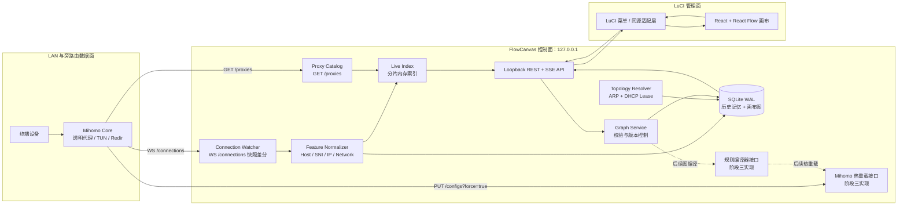
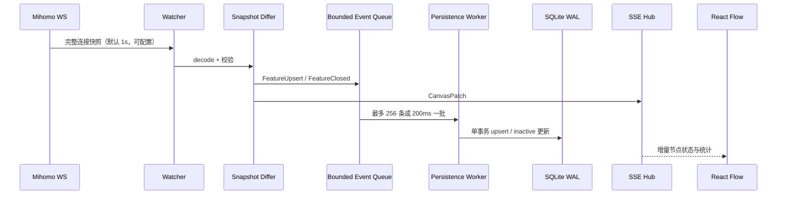
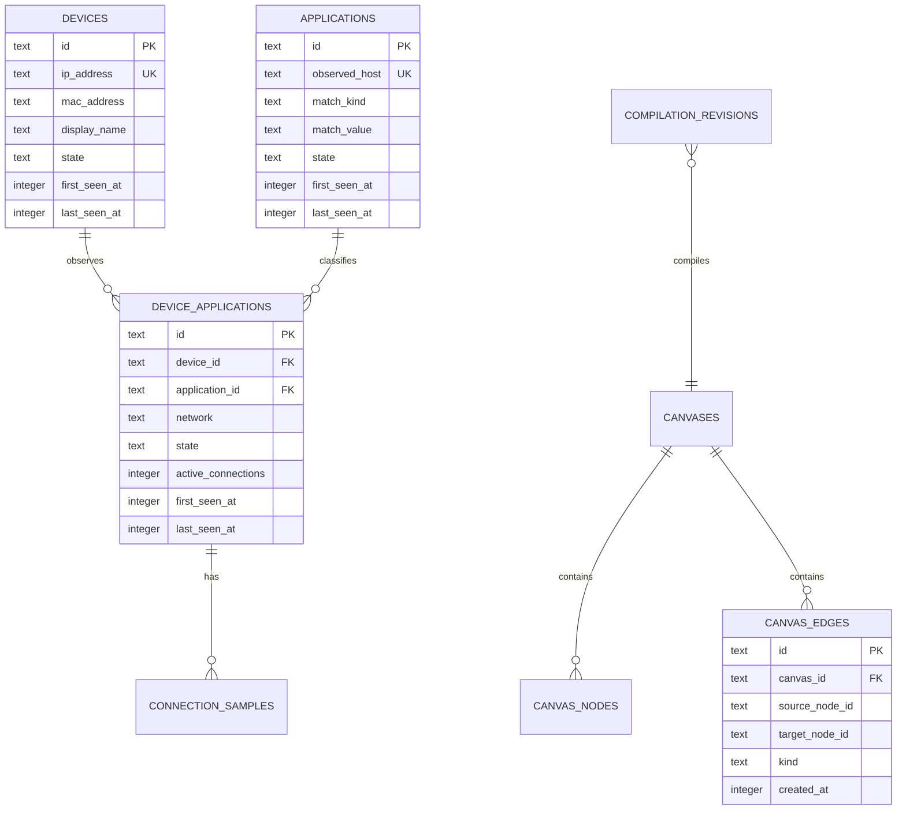

# FlowCanvas 第一阶段架构蓝图

**文档状态：** 第一阶段基线  
**适用版本：** `luci-app-flowcanvas` 0.1.0-dev  
**作者：** Manus AI  
**更新日期：** 2026-07-27

## 1. 设计目标与边界

FlowCanvas 是运行在 OpenWrt/iStoreOS 旁路由上的**意图驱动网络编排控制面**。它不抓取、解密或转发用户业务数据；守护进程仅订阅 Mihomo 已建立连接的控制器快照，从其中归一化出源终端、真实域名特征、协议与当前出口链路，并将历史观察结果固化到本地 SQLite。Mihomo 的 `GET/WS /connections` 会提供活动连接快照；其中的每条连接含 `metadata`、连接标识、流量统计、命中规则及代理链信息。[1]

> **重要边界：** FlowCanvas 的“动态 L7 嗅探”依赖 Mihomo 的内置嗅探器，而不是在旁路由上新增独立的旁路抓包器。Mihomo 的嗅探器支持 HTTP、TLS 与 QUIC，并可针对没有已知域名的流量启用 `parse-pure-ip`。[2] 因此 FlowCanvas 消费的是 Mihomo 归一化后的 `metadata.host` / `metadata.sniffHost`，既避免双重解析，也避免扩大隐私与性能攻击面。

第一阶段交付可构建的服务与前端骨架、数据迁移、稳定的控制面 API，以及可由第二阶段填充的实现接口。规则编译、配置写回和 OpenWrt 打包均在后续阶段接入，但其类型契约已在本阶段冻结。

| 维度 | 架构选择 | 理由 |
|---|---|---|
| 运行形态 | Go 守护进程 + React/React Flow 静态前端 + LuCI 外壳 | 将实时 I/O 与可视化交互解耦，适配 OpenWrt 的轻量服务模型。 |
| L7 信号来源 | Mihomo `WS /connections` 快照差分 | 控制器是内核权威数据源；避免再布置 pcap/AF_PACKET 数据面。 |
| 历史记忆 | SQLite WAL 单库 | 单机高并发读写、断电一致性、部署无额外数据库服务。 |
| 设备发现 | `/proc/net/arp` 优先，DHCP lease 可插拔补充 | 仅从路由器本地状态识别终端，不依赖云端资产库。 |
| 出口发现 | Mihomo `GET /proxies` | 列表、类型、存活状态和 UDP 能力由内核运行时决定。[1] |
| 前端状态 | HTTP 快照 + SSE 增量事件 | 首屏确定性与低开销实时更新兼得；前端不直接访问 Mihomo。 |
| 安全边界 | Mihomo 与 FlowCanvas 控制 API 均只监听 loopback | 不将 Mihomo Secret 或管理接口暴露给浏览器及 LAN 客户端。 |

## 2. 逻辑架构



Mihomo 连接控制器是**周期性完整快照**而非逐连接增删事件流。Watcher 因而对每个快照计算 `connection.id` 集合差异：首次出现为 `upsert`，持续存在为 `refresh`，上一快照存在而本轮缺失为 `closed`。该行为可由当前 Mihomo 控制器源码验证：WebSocket 会按 `interval` 周期发送 `DefaultManager.Snapshot()`。[3] 这也是“连接断开不删除、仅置为 inactive”的可靠实现基础。

### 2.1 连接元数据归一化优先级

Mihomo 元数据包含 `host`、`sniffHost`、`destinationIP`、`sourceIP`、`network`、端口与远端目的地等字段；其规则匹配域名优先采用 `sniffHost`，没有时回退到 `host`。[4] FlowCanvas 的规范化层采用下表优先级，且从不伪造域名。

| 输出字段 | 原始输入优先级 | 规则 | 无法取得时的处理 |
|---|---|---|---|
| `source_ip` | `metadata.sourceIP` | 必须是可解析 IPv4/IPv6 地址。 | 丢弃该条观察，避免生成不可执行的 SRC-IP 规则。 |
| `destination_ip` | `metadata.destinationIP` | 保留真实解析后的目的 IP；不作为域名规则替代品。 | 允许为空。 |
| `observed_host` | `metadata.sniffHost` → `metadata.host` | 小写化、去尾点、IDNA 规范化；拒绝 IP 字面量与非法主机名。 | 标为 `unclassified`，不创建 Filter 节点。 |
| `network` | `metadata.network` | 映射为 `tcp`、`udp`；若 Mihomo 后续暴露 `quic`，额外保留 `transport_hint=quic`。 | 映射为 `unknown`，不可参与规则编译。 |
| `connection_id` | `connection.id` | 使用 Mihomo UUID 作为瞬时活动连接索引键。 | 丢弃；不以五元组猜测连接身份。 |
| `proxy_chain` | `connection.chains` / `providerChains` | 仅作观测显示，不作为目标节点唯一键。 | 为空数组。 |

## 3. 高吞吐实时处理设计

目标设备为 x86 软路由且内存充足，因此性能策略优先保障**低延迟、批量持久化和连接风暴下的反压可观测性**，而非以牺牲可读性换取极低内存占用。



| 组件 | 并发模型 | 初始参数 | 设计意图 |
|---|---|---:|---|
| `ConnectionWatcher` | 1 个重连循环 + 1 个 JSON 解码器 | `interval=250ms`，可配置 | 单 WebSocket 有序消费，避免同一快照多次并发解析。 |
| `LiveIndex` | 64 分片 map，按稳定哈希分片 | 64 shard | 在大量活跃连接时降低写锁竞争；只保留活动索引。 |
| `EventQueue` | 有界 channel | 8,192 条 | 保护数据库写入抖动；满时合并同一 feature 的 refresh，绝不无界积压。 |
| `SQLiteWriter` | 单写协程、批事务 | 256 条或 200ms | SQLite 单写者语义下以短事务换吞吐和可预测 tail latency。 |
| `SSE Hub` | 独立订阅者管理器 | 每订阅者 256 条 ring buffer | 慢浏览器只丢弃低价值 refresh，并收到 `resync` 指令，不阻塞嗅探与落库。 |
| `TopologyResolver` | 30 秒周期 + API 显式刷新 | 30 秒 | ARP/DHCP 变化远慢于连接流，避免占用热路径。 |
| `ProxyCatalog` | 10 秒周期 + API 显式刷新 | 10 秒 | 出口健康状态独立于连接快照，允许延迟显示。 |

数据库打开后设置 `journal_mode=WAL`、`synchronous=NORMAL`、`busy_timeout=5000`、`foreign_keys=ON`。服务在无 MIGRATION 锁竞争时才启动 Watcher；任何不可恢复的 schema 版本不匹配都会使服务拒绝提供写接口，而不是悄然损坏记忆数据。

## 4. SQLite 数据模型

### 4.1 实体关系



### 4.2 第一版 schema

```sql
PRAGMA foreign_keys = ON;

CREATE TABLE IF NOT EXISTS schema_migrations (
  version       INTEGER PRIMARY KEY,
  applied_at    INTEGER NOT NULL
);

CREATE TABLE IF NOT EXISTS devices (
  id            TEXT PRIMARY KEY,
  ip_address    TEXT NOT NULL UNIQUE,
  mac_address   TEXT,
  display_name  TEXT NOT NULL,
  hostname      TEXT,
  state         TEXT NOT NULL CHECK (state IN ('active', 'inactive', 'unknown')),
  first_seen_at INTEGER NOT NULL,
  last_seen_at  INTEGER NOT NULL,
  updated_at    INTEGER NOT NULL
);
CREATE INDEX IF NOT EXISTS idx_devices_state_last_seen ON devices(state, last_seen_at DESC);

CREATE TABLE IF NOT EXISTS applications (
  id            TEXT PRIMARY KEY,
  observed_host TEXT NOT NULL UNIQUE COLLATE NOCASE,
  match_kind    TEXT NOT NULL CHECK (match_kind IN ('domain', 'suffix', 'keyword')),
  match_value   TEXT NOT NULL,
  state         TEXT NOT NULL CHECK (state IN ('active', 'inactive')),
  first_seen_at INTEGER NOT NULL,
  last_seen_at  INTEGER NOT NULL,
  updated_at    INTEGER NOT NULL
);
CREATE INDEX IF NOT EXISTS idx_applications_state_last_seen ON applications(state, last_seen_at DESC);

CREATE TABLE IF NOT EXISTS device_applications (
  id                 TEXT PRIMARY KEY,
  device_id          TEXT NOT NULL REFERENCES devices(id) ON DELETE RESTRICT,
  application_id     TEXT NOT NULL REFERENCES applications(id) ON DELETE RESTRICT,
  network            TEXT NOT NULL CHECK (network IN ('tcp', 'udp', 'unknown')),
  transport_hint     TEXT,
  destination_ip     TEXT,
  destination_port   INTEGER,
  state              TEXT NOT NULL CHECK (state IN ('active', 'inactive')),
  active_connections INTEGER NOT NULL DEFAULT 0 CHECK (active_connections >= 0),
  first_seen_at      INTEGER NOT NULL,
  last_seen_at       INTEGER NOT NULL,
  inactive_at        INTEGER,
  UNIQUE(device_id, application_id, network)
);
CREATE INDEX IF NOT EXISTS idx_device_applications_device_state ON device_applications(device_id, state, last_seen_at DESC);
CREATE INDEX IF NOT EXISTS idx_device_applications_app_state ON device_applications(application_id, state, last_seen_at DESC);

CREATE TABLE IF NOT EXISTS connection_samples (
  connection_id       TEXT PRIMARY KEY,
  device_application_id TEXT NOT NULL REFERENCES device_applications(id) ON DELETE CASCADE,
  source_ip           TEXT NOT NULL,
  destination_ip      TEXT,
  observed_host       TEXT,
  network             TEXT NOT NULL,
  opened_at           INTEGER NOT NULL,
  last_observed_at    INTEGER NOT NULL,
  closed_at           INTEGER,
  upload_bytes        INTEGER NOT NULL DEFAULT 0,
  download_bytes      INTEGER NOT NULL DEFAULT 0,
  proxy_chain_json    TEXT NOT NULL DEFAULT '[]',
  matched_rule        TEXT,
  matched_rule_payload TEXT
);
CREATE INDEX IF NOT EXISTS idx_connection_samples_da_last_observed ON connection_samples(device_application_id, last_observed_at DESC);
CREATE INDEX IF NOT EXISTS idx_connection_samples_closed_at ON connection_samples(closed_at);

CREATE TABLE IF NOT EXISTS canvases (
  id            TEXT PRIMARY KEY,
  name          TEXT NOT NULL,
  revision      INTEGER NOT NULL DEFAULT 0,
  is_default    INTEGER NOT NULL DEFAULT 0 CHECK (is_default IN (0, 1)),
  created_at    INTEGER NOT NULL,
  updated_at    INTEGER NOT NULL
);
CREATE UNIQUE INDEX IF NOT EXISTS idx_canvases_one_default ON canvases(is_default) WHERE is_default = 1;

CREATE TABLE IF NOT EXISTS canvas_nodes (
  id            TEXT PRIMARY KEY,
  canvas_id     TEXT NOT NULL REFERENCES canvases(id) ON DELETE CASCADE,
  node_kind     TEXT NOT NULL CHECK (node_kind IN ('source', 'filter', 'target')),
  resource_id   TEXT NOT NULL,
  position_x    REAL NOT NULL,
  position_y    REAL NOT NULL,
  data_json     TEXT NOT NULL DEFAULT '{}',
  created_at    INTEGER NOT NULL,
  updated_at    INTEGER NOT NULL,
  UNIQUE(canvas_id, node_kind, resource_id)
);

CREATE TABLE IF NOT EXISTS canvas_edges (
  id             TEXT PRIMARY KEY,
  canvas_id      TEXT NOT NULL REFERENCES canvases(id) ON DELETE CASCADE,
  source_node_id TEXT NOT NULL REFERENCES canvas_nodes(id) ON DELETE CASCADE,
  target_node_id TEXT NOT NULL REFERENCES canvas_nodes(id) ON DELETE CASCADE,
  edge_kind      TEXT NOT NULL CHECK (edge_kind IN ('source_to_filter', 'filter_to_target')),
  created_at     INTEGER NOT NULL,
  UNIQUE(canvas_id, source_node_id, target_node_id)
);
CREATE INDEX IF NOT EXISTS idx_canvas_edges_canvas ON canvas_edges(canvas_id);

CREATE TABLE IF NOT EXISTS compilation_revisions (
  id                TEXT PRIMARY KEY,
  canvas_id         TEXT NOT NULL REFERENCES canvases(id) ON DELETE RESTRICT,
  canvas_revision   INTEGER NOT NULL,
  status            TEXT NOT NULL CHECK (status IN ('draft', 'validated', 'applied', 'failed', 'rolled_back')),
  generated_yaml    TEXT,
  mihomo_config_hash TEXT,
  error_message     TEXT,
  created_at        INTEGER NOT NULL,
  applied_at        INTEGER
);
CREATE INDEX IF NOT EXISTS idx_compilation_revisions_canvas_revision ON compilation_revisions(canvas_id, canvas_revision DESC);
```

`applications` 保存**真实观察到的域名**与一个可编译的域名匹配表达式。默认 `match_kind='domain'`、`match_value=observed_host`，以免自动扩大规则范围；用户在第二阶段画布节点属性中明确确认后，才能将其提升为 `suffix` 或 `keyword`。Mihomo 将 `DOMAIN-SUFFIX` 定义为后缀匹配、`DOMAIN-KEYWORD` 定义为域名关键字匹配。[5]

## 5. Canvas 领域模型与严格连线约束

画布只保存**用户意图**（位置、边、已确认的节点匹配策略）；实时发现节点由后端按数据库与 Mihomo 动态拼装。这样即使一个离线终端或不再活动的域名从实时索引消失，历史节点依旧可置灰、可审计、可重新连线。

| 节点类别 | 稳定 ID 格式 | `resource_id` | 活跃判定 | 可连接的目标 |
|---|---|---|---|---|
| Source | `source:{device_id}` | `devices.id` | ARP/DHCP 在线或存在活动 `device_applications` | 仅同一设备所属的 Filter |
| Filter | `filter:{device_application_id}` | `device_applications.id` | `active_connections > 0` | 任意 Target |
| Target | `target:{proxy_name_hash}` | URL-safe 代理名 | Mihomo 目录中存在，另显示 `alive` | 不可作为 source |

服务器是规则的最终裁决者。React Flow 仅提供即时交互反馈，所有 `PUT /graph` 仍必须经过以下验证：

1. `source` 节点只允许连接 `filter` 节点，且 Filter 的 `device_id` 必须等于 Source 的设备 ID。
2. `filter` 节点只允许连接 `target` 节点，目标名称必须在当前 Mihomo `/proxies` 目录中存在。
3. 禁止反向边、自环、重复边、Source→Target、Filter→Filter、Target 作为边源。
4. 一个 Filter 可以有多个 Target 边，但第二阶段的图编译器会要求为同一 Filter 选择**唯一有效 Target**；否则只保存草稿、拒绝应用。
5. 写入要求携带 `If-Match: "canvas-{revision}"`，冲突时返回 `409` 和最新 revision，防止多标签页静默覆盖。

## 6. REST 与 SSE API 契约（v1）

服务在开发环境监听 `127.0.0.1:16789`。生产环境中，LuCI 适配层将把同源 `/cgi-bin/luci/admin/services/flowcanvas/api/...` 请求安全地转发到该 loopback 服务；浏览器绝不接触 Mihomo API Secret。所有响应使用 `application/json; charset=utf-8`；时间采用 RFC 3339 UTC 字符串；所有变更 API 使用 JSON 请求体。

### 6.1 通用响应与错误

```json
{
  "requestId": "01J7QQTNR6V5D99WB88S1WN3NE",
  "data": {}
}
```

```json
{
  "requestId": "01J7QQTNR6V5D99WB88S1WN3NE",
  "error": {
    "code": "INVALID_EDGE_DIRECTION",
    "message": "只允许 Source → Filter → Target 的有向连线。",
    "details": {"sourceKind": "target", "targetKind": "filter"}
  }
}
```

| HTTP 状态 | 错误码 | 含义 |
|---:|---|---|
| 400 | `INVALID_REQUEST` / `INVALID_NODE` / `INVALID_EDGE_DIRECTION` | 请求格式、节点资源或连线层级不合法。 |
| 401 | `UNAUTHORIZED` | 仅 loopback 和 LuCI 受信适配层可调用。 |
| 404 | `NOT_FOUND` / `MIHOMO_PROXY_NOT_FOUND` | 对象或当前出口不存在。 |
| 409 | `CANVAS_REVISION_CONFLICT` | `If-Match` 与当前画布 revision 不一致。 |
| 422 | `UNCLASSIFIED_FEATURE` / `GRAPH_NOT_COMPILABLE` | 观察对象没有可执行域名表达式或图不满足编译约束。 |
| 424 | `MIHOMO_UNAVAILABLE` | 控制器 API 或 WebSocket 不可用。 |
| 503 | `MIGRATION_REQUIRED` / `EVENT_BACKPRESSURE` | 数据库升级未完成或服务主动保护热路径。 |

### 6.2 端点清单

| 方法与路径 | 用途 | 返回 / 幂等性 |
|---|---|---|
| `GET /api/v1/health` | 服务、数据库、Mihomo API 与 WebSocket 状态 | 当前状态；幂等。 |
| `GET /api/v1/canvas` | 获取默认画布、实时发现节点、历史节点和已保存边 | `CanvasSnapshot`；幂等。 |
| `GET /api/v1/canvas/events` | 建立 SSE 订阅，接收 `canvas.patch` / `resync` / `health` | 长连接；只读。 |
| `PUT /api/v1/canvas/graph` | 原子保存节点布局与边；服务器执行严格图校验 | 新 revision；使用 `If-Match`。 |
| `POST /api/v1/discovery/refresh` | 触发 ARP/DHCP 与出口目录即时刷新 | 接受任务状态；幂等语义。 |
| `GET /api/v1/features` | 分页检索历史观察组合，支持 `state`、`deviceId`、`host` | `FeaturePage`；幂等。 |
| `GET /api/v1/targets` | 获取当前 Mihomo 出口候选项 | `Target[]`；幂等。 |
| `POST /api/v1/compilations/validate` | **预留：阶段三**，图→规则预检查 | `CompilationPreview`。 |
| `POST /api/v1/compilations/apply` | **预留：阶段三**，生成配置并热重载 | `CompilationResult`。 |

### 6.3 `CanvasSnapshot` 结构

```json
{
  "requestId": "01J7QQTNR6V5D99WB88S1WN3NE",
  "data": {
    "canvas": {
      "id": "default",
      "name": "默认编排图",
      "revision": 12,
      "etag": "canvas-12",
      "updatedAt": "2026-07-27T12:00:00Z"
    },
    "nodes": [
      {
        "id": "source:dev-3fd8f460",
        "kind": "source",
        "position": {"x": 80, "y": 180},
        "data": {
          "deviceId": "dev-3fd8f460",
          "label": "LivingRoom-TV",
          "ip": "192.168.1.50",
          "mac": "00:11:22:33:44:55",
          "state": "active",
          "lastSeenAt": "2026-07-27T11:59:58Z"
        }
      },
      {
        "id": "filter:da-5ddf4ae9",
        "kind": "filter",
        "position": {"x": 460, "y": 180},
        "data": {
          "deviceApplicationId": "da-5ddf4ae9",
          "deviceId": "dev-3fd8f460",
          "observedHost": "v.qq.com",
          "network": "tcp",
          "transportHint": "tls",
          "state": "active",
          "activeConnections": 2,
          "match": {"kind": "domain", "value": "v.qq.com"},
          "firstSeenAt": "2026-07-27T09:12:01Z",
          "lastSeenAt": "2026-07-27T11:59:58Z"
        }
      },
      {
        "id": "target:tailscale0",
        "kind": "target",
        "position": {"x": 840, "y": 180},
        "data": {
          "proxyName": "tailscale0",
          "proxyType": "DIRECT",
          "alive": true,
          "udp": true,
          "state": "active"
        }
      }
    ],
    "edges": [
      {
        "id": "edge-sf-8b22",
        "source": "source:dev-3fd8f460",
        "target": "filter:da-5ddf4ae9",
        "kind": "source_to_filter"
      },
      {
        "id": "edge-ft-d1a5",
        "source": "filter:da-5ddf4ae9",
        "target": "target:tailscale0",
        "kind": "filter_to_target"
      }
    ],
    "discovery": {
      "connectionsUpdatedAt": "2026-07-27T11:59:58Z",
      "devicesUpdatedAt": "2026-07-27T11:59:30Z",
      "targetsUpdatedAt": "2026-07-27T11:59:55Z"
    }
  }
}
```

### 6.4 保存画布图请求

```http
PUT /api/v1/canvas/graph HTTP/1.1
If-Match: "canvas-12"
Content-Type: application/json
```

```json
{
  "nodePositions": [
    {"id": "source:dev-3fd8f460", "position": {"x": 80, "y": 180}},
    {"id": "filter:da-5ddf4ae9", "position": {"x": 460, "y": 180}},
    {"id": "target:tailscale0", "position": {"x": 840, "y": 180}}
  ],
  "edges": [
    {
      "id": "edge-sf-8b22",
      "source": "source:dev-3fd8f460",
      "target": "filter:da-5ddf4ae9"
    },
    {
      "id": "edge-ft-d1a5",
      "source": "filter:da-5ddf4ae9",
      "target": "target:tailscale0"
    }
  ]
}
```

成功时返回 `200` 和更新后的 `CanvasSnapshot` 子集，并回传新 ETag。SSE 事件会广播：

```text
event: canvas.patch
id: 13
data: {"canvasRevision":13,"ops":[{"op":"replace","path":"/nodes/filter:da-5ddf4ae9/data/state","value":"inactive"}]}
```

## 7. Mihomo 交互契约与前置检查

| 交互 | 方法 | FlowCanvas 用途 | 失败策略 |
|---|---|---|---|
| `/connections` | WebSocket，`?interval=250` | 活动连接快照、增删差分、流量与规则观察 | 指数退避重连（250ms 至 30s）；保留 SQLite 历史。 |
| `/proxies` | `GET` | 生成 Target 候选、读取 `type`、`alive`、`udp` | 标记 `targetsUpdatedAt` 过期；禁止新图应用。 |
| `/configs` | `PUT ?force=true` | 阶段三配置热重载 | 编译前备份，失败记录审计并返回可读错误。 |

Mihomo 文档定义 `/proxies` 为按代理或策略组名称索引的对象，并暴露 `name`、`type`、`udp`、`alive` 等公共字段；`/configs` 的 `PUT` 支持以 `force=true` 重载配置。[1] 路由规则按从上到下的顺序匹配，且逻辑组合规则格式为 `LOGIC_TYPE,((payload1),(payload2)),Proxy`。[5] 因此后续编译器将把用户确认的图转换为新管理规则段，且不能粗暴替换用户的既有规则。

推荐的 Mihomo 前置配置如下。`override-destination` 是否启用应由用户的现有 Fake-IP / TUN 策略决定；FlowCanvas 不在第一阶段自行改写这一项。

```yaml
external-controller: 127.0.0.1:9090
secret: "<仅保存于 /etc/config/flowcanvas，权限 0600>"
sniffer:
  enable: true
  parse-pure-ip: true
  sniff:
    HTTP: { ports: [80, 8080-8880] }
    TLS: { ports: [443, 8443] }
    QUIC: { ports: [443, 8443] }
```

## 8. 安全、隐私与故障隔离

FlowCanvas 将域名、源 IP、MAC 与设备名称视为本地敏感网络元数据。它不上传数据、不记录请求正文、Cookie、TLS 证书内容或明文载荷。服务日志默认对 Host 做哈希截断；只有用户在 LuCI 中主动打开诊断模式时才记录原始 Host，且诊断日志轮转保留 24 小时。

| 风险 | 控制措施 |
|---|---|
| 浏览器窃取 Mihomo Secret | Secret 只由 Go 后端从 root-only UCI 配置读取，前端只调用同源 LuCI 路径。 |
| Mihomo 断开或升级 | Watcher 状态机、指数退避、健康 API；历史数据不会被清空。 |
| 连接暴增压垮 SQLite | 有界队列、按 feature 合并 refresh、短批量事务和 WAL。 |
| 画布并发编辑 | ETag/revision 乐观锁；冲突返回最新 revision。 |
| 域名被错误扩大 | 默认精确 `DOMAIN`，用户显式确认后才使用 `DOMAIN-SUFFIX` 或 `DOMAIN-KEYWORD`。 |
| 外部恶意 HTTP 调用 | Go API 只绑定 loopback；生产端由 LuCI 会话认证与 CSRF 保护承接。 |

## 9. 模块职责与代码映射

| 路径 | 职责 | 第一阶段状态 |
|---|---|---|
| `backend/cmd/flowcanvasd` | 进程装配、配置加载、优雅关闭 | 骨架实现。 |
| `backend/internal/domain` | 不依赖传输和存储的领域类型、ID、图验证错误 | 骨架实现。 |
| `backend/internal/mihomo` | REST client、WS watcher、快照模型、特征归一化 | API 与模型骨架。 |
| `backend/internal/store` | SQLite 打开、迁移、Repository 接口 | schema、迁移和内存可替换接口。 |
| `backend/internal/topology` | ARP / DHCP lease 读取、设备合并 | 接口与 ARP 读取骨架。 |
| `backend/internal/graph` | 图版本、边验证、后续编译器端口 | 骨架实现。 |
| `backend/internal/api` | REST、SSE、错误封装 | 可运行 health/canvas 骨架。 |
| `frontend/src` | React Flow 画布、严格连线、API client | 可运行 Vite 骨架。 |
| `luci-app-flowcanvas` | LuCI 菜单、静态资源落点、服务文件与后续 ipk Makefile | 目录预留。 |

## 10. 第一阶段验收标准

第一阶段完成时，工程必须满足以下要求：Go 服务可启动并通过 `GET /api/v1/health` 返回结构化状态；SQLite 初始化会应用上述迁移并创建默认画布；前端可在模拟数据下渲染 Source、Filter、Target 三类 React Flow 节点；前端与后端均拒绝违反 Source → Filter → Target 的连线；API 类型、迁移与架构文档保持一致。Mihomo 实时 WebSocket、ARP 轮询和 `/proxies` 真实调用在第二阶段接入具体实现，但它们的输入输出契约不得破坏本文件定义。

## References

[1]: https://wiki.metacubex.one/en/api/ "Mihomo 官方 API 文档"
[2]: https://wiki.metacubex.one/en/config/sniff/ "Mihomo 官方域名嗅探配置文档"
[3]: https://github.com/MetaCubeX/mihomo/blob/Meta/hub/route/connections.go "Mihomo connections WebSocket 控制器源码"
[4]: https://github.com/MetaCubeX/mihomo/blob/Meta/constant/metadata.go "Mihomo Metadata 源码"
[5]: https://wiki.metacubex.one/en/config/rules/ "Mihomo 官方路由规则文档"
