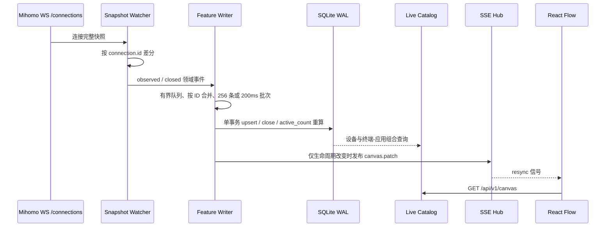
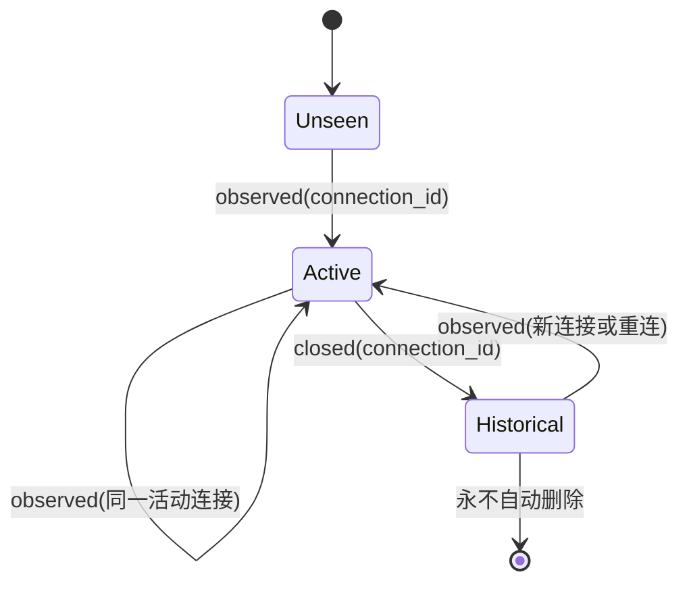

# 第二阶段：实时嗅探记忆与活跃状态同步

**状态：** 已完成  
**版本基线：** `0.2.0-dev`  
**更新日期：** 2026-07-27

## 1. 本阶段目标

本阶段将第一阶段定义的契约接入为真实运行链路：Mihomo `WS /connections` 快照被持续消费，Host/SNI 特征被规范化后批量写入 SQLite，连接从快照消失时仍保留其历史记录，但将对应的 `device_applications` 状态切换为 `inactive`。Mihomo 控制器的 `/connections` 同时支持 HTTP 获取和 WebSocket 推送，且 WebSocket 的刷新间隔可用 `interval` 参数指定。[1]

> **关键语义：** FlowCanvas 的活跃状态由 `connection_samples.closed_at IS NULL` 作为单一事实来源计算，而不是依赖浏览器内存或定时超时推测。因此，守护进程重启后会主动将遗留的开放样本关闭，避免把已断开的旧连接误显示为 active。

## 2. 运行链路

| 环节 | 实现行为 | 结果 |
|---|---|---|
| 快照归一化 | 优先 `sniffHost`，回退 `host`；拒绝 IP 字面量或非法 Host。 | 不会为纯 IP 流量伪造动态应用节点。 |
| 连接差分 | 当前快照存在即 `observed`；上一轮存在、本轮缺失即 `closed`。 | 断连具备确定性，不依赖任意 idle 超时。 |
| 批处理 | 默认 8,192 条队列、256 条批量、200ms flush。队列满时按 `connection_id` 保留最新事件。 | 防止数据库短暂抖动阻塞 WebSocket。 |
| SQLite 事务 | Upsert 设备、应用、组合和连接样本，随后重算活跃连接数与状态。 | `active_connections` 与历史样本保持一致。 |
| 前端通知 | 仅新增、重连、连接归属迁移或首次关闭产生重同步事件。 | 正常每 250ms 快照刷新不会造成整图反复 GET。 |

## 3. 状态机

| 数据对象 | active 判定 | inactive 判定 | 保留策略 |
|---|---|---|---|
| `connection_samples` | `closed_at IS NULL` | `closed_at IS NOT NULL` | 永久保留，后续可增加清理策略。 |
| `device_applications` | 至少一个关联样本未关闭 | 所有关联样本均已关闭 | 保留，供画布置灰及再次编排。 |
| `applications` | 任一终端-应用组合 active | 所有组合 inactive | 保留真实观察到的域名。 |
| `devices` | 由 ARP/DHCP 发现，或仍有活动组合 | 未被当前拓扑观察且无活动组合 | 保留历史终端节点。 |

## 4. 拓扑与出口目录

终端发现器读取 `/proc/net/arp`，再可选合并 dnsmasq DHCP lease 文件（默认 `/tmp/dhcp.leases`）。DHCP hostname 优先于通用“设备 IP”占位名称。Mihomo `GET /proxies` 被周期性读取并转换为 Target 节点；该 API 的代理对象包含 `name`、`type`、`udp` 与 `alive` 等状态字段。[1]

| 刷新器 | 默认周期 | 写入目标 | 失败处理 |
|---|---:|---|---|
| Connection Watcher | 250ms | `connection_samples`、`device_applications` | 指数退避重连，最大 30 秒。 |
| Topology Refresher | 30s | `devices` | 写日志后下轮重试，不影响连接入库。 |
| Proxy Refresher | 10s | 内存 Target catalog | 写日志后下轮重试，保留上次有效出口目录。 |

## 5. 控制面变化

`GET /api/v1/canvas`、`GET /api/v1/features` 和 `GET /api/v1/targets` 已从真实 `LiveCatalog` 获取数据。前端保留 SSE 订阅；收到 `canvas.patch` 或 `resync` 后拉取新快照。`POST /api/v1/discovery/refresh` 已由“预留接口”升级为同步执行本地拓扑与 Mihomo 出口刷新；未启用真实运行模式时会明确返回 `501 DISCOVERY_REFRESH_UNAVAILABLE`。

Mihomo 的 `/proxies` 和 `/connections` 都需要通过控制器的鉴权设置访问；生产部署应让 FlowCanvas 后端保有 Secret，并使浏览器始终经由 LuCI 同源接口访问，而不能将 Secret 发至前端。[1] [2]

## 6. 运行配置

| 环境变量 | 默认值 | 说明 |
|---|---:|---|
| `FLOWCANVAS_DEMO` | `false` | 生产默认真实运行；开发可设为 `true` 使用演示目录。 |
| `FLOWCANVAS_MIHOMO_CONTROLLER` | `http://127.0.0.1:9090` | Mihomo 外部控制器地址。 |
| `FLOWCANVAS_MIHOMO_SECRET` | 空 | 控制器 Bearer Secret。 |
| `FLOWCANVAS_CONNECTION_INTERVAL` | `250ms` | WebSocket 快照间隔，范围 100ms–10s。 |
| `FLOWCANVAS_FEATURE_QUEUE_CAPACITY` | `8192` | 高频事件有界队列容量。 |
| `FLOWCANVAS_FEATURE_BATCH_SIZE` | `256` | SQLite 事务最大事件数。 |
| `FLOWCANVAS_FEATURE_FLUSH_INTERVAL` | `200ms` | 低流量时的批处理提交周期。 |
| `FLOWCANVAS_ARP_PATH` | `/proc/net/arp` | ARP 表路径。 |
| `FLOWCANVAS_DHCP_LEASE_PATH` | `/tmp/dhcp.leases` | dnsmasq lease 路径。 |
| `FLOWCANVAS_TOPOLOGY_INTERVAL` | `30s` | 终端拓扑刷新周期。 |
| `FLOWCANVAS_PROXY_REFRESH_INTERVAL` | `10s` | Mihomo 出口刷新周期。 |

## 7. 验证结果

第二阶段新增了端到端测试：模拟 Mihomo WebSocket 依次发送包含 `v.qq.com` 的连接快照和空快照，验证记录先写入再转换为 `inactive` 历史 Filter；同时检查 React Flow API 可获取该历史节点与实时 Target。全套 Go 测试、竞争检测与前端生产构建均通过。

| 验证项 | 结果 |
|---|---|
| 连接观察 → SQLite 样本写入 | 通过。 |
| 同组合多连接计数 | 通过。 |
| 最后一条连接关闭 → Filter inactive | 通过。 |
| 重复 observed/closed 快照去抖 | 通过。 |
| ARP + DHCP hostname 合并 | 通过。 |
| Mihomo `/proxies` → Target 节点 | 通过。 |
| `/canvas`、`/features`、`/targets` 真实目录 API | 通过。 |
| `go test -race ./...` | 通过。 |

## References

[1]: https://wiki.metacubex.one/en/api/ "Mihomo 官方 API 文档"
[2]: https://wiki.metacubex.one/en/config/general/ "Mihomo External Controller 配置文档"
