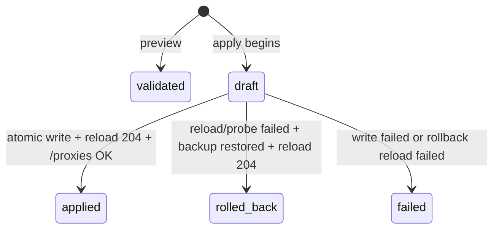

# 第三阶段编译器设计：图到 Mihomo 规则、热重载与回滚

## 1. 编译目标

每个被完整连接的画布意图均转换为一个**无出口动作的匹配表达式**：

```text
终端 IP + 动态应用 MatchSpec → AND,((SRC-IP-CIDR,<ip>/<mask>),(<DOMAIN 类规则>,<value>))
```

由于 Mihomo 的 `RULE-SET` 在外层指定出口，且 classical provider 的 payload 只负责匹配，编译器必须按 Target 分组。每个出口生成一个 `flowcanvas-<hash>` inline provider，并生成一条优先级更高的顶层 `RULE-SET`。[1] [2]

```yaml
rule-providers:
  flowcanvas-1307160f3af2:
    type: inline
    behavior: classical
    payload:
      - AND,((SRC-IP-CIDR,192.168.1.50/32),(DOMAIN,v.qq.com))
rules:
  - RULE-SET,flowcanvas-1307160f3af2,Proxy-US
  # 用户既有规则，保持顺序和内容
```

## 2. 输入图约束

编译器不会放宽保存图时的约束，并额外拒绝以下情形：

| 条件 | 编译结果 | 原因 |
|---|---|---|
| Filter 没有 Source 入边 | 拒绝 | 无法确定源终端 IP。 |
| Filter 没有 Target 出边 | 拒绝 | 用户尚未完成意图。 |
| Filter 有多个 Target 出边 | 拒绝 | 顺序规则会隐式选择一个出口，存在语义歧义。 |
| Source IP 不是合法 IP | 拒绝 | 无法生成安全的 `SRC-IP-CIDR`。 |
| `match.kind/value` 不受支持或包含规则分隔符 | 拒绝 | 防止规则注入或产生不可解析 YAML。 |
| Target 不在当前 Mihomo 目录 | 拒绝 | 避免生成不可解析的出口引用。 |
| Target 当前不健康 | 预警但允许 | 代理/策略组仍存在，用户可保留预期路由。 |

Filter 的精确、后缀和关键词匹配分别映射为 `DOMAIN`、`DOMAIN-SUFFIX` 与 `DOMAIN-KEYWORD`。所有 Provider、Payload 与顶层 RULE-SET 按稳定键排序，保证同一图产生字节稳定的 overlay YAML。

## 3. 受管主配置合并

Mihomo 没有在官方 YAML 语法文档中声明独立配置 include 指令，因此 FlowCanvas 以 YAML AST 读取已显式配置的主文件，只修改两个受管区域：

1. 删除 `rule-providers` 映射中键名前缀为 `flowcanvas-` 的条目，再写入新分组；
2. 删除 `rules` 数组中以 `RULE-SET,flowcanvas-` 开头的条目，再将新规则插入用户规则之前。

其他顶层键、规则、providers、proxy groups、注释和 YAML 节点由 AST 保留。每次 apply 先写入同目录 `.flowcanvas-backups/<revision>.yaml`，随后采用临时文件 + `fsync` + 原子 rename 写回配置路径。

> 受管前缀是关键隔离边界。FlowCanvas 不会删除或改写不以 `flowcanvas-` 开头的 provider/rule，即使其结构类似。

## 4. 本地与内核校验

| 层次 | 校验内容 | 失败处理 |
|---|---|---|
| 图语义 | 边方向、完整性、唯一 Target、IP、MatchSpec、Target 名称 | 不写文件、不创建 apply。 |
| YAML AST | 主配置可解析且根节点为 Mapping；保留区域类型正确 | 不写文件，记录失败审计。 |
| 生成 YAML | 重新解析候选完整配置，检查受管 provider/rule 结构 | 不写文件，记录失败审计。 |
| Mihomo | `PUT /configs?force=true` 解析并应用候选路径 | 写回备份并再次 reload。 |
| 事后存活 | `GET /proxies` 可访问 | 写回备份并再次 reload。 |

## 5. 回滚和审计状态机



`compilation_revisions` 保存 canvas revision、受管 overlay YAML、候选配置内容哈希、错误信息和应用时间。`compilation_rollbacks` 保存原配置哈希、备份文件路径、候选哈希、回滚状态与错误。完整主 YAML 可能含代理凭据，因此不存储在 SQLite 或 API 响应中。

## 6. 控制面 API

| API | 副作用 | 响应重点 |
|---|---|---|
| `POST /api/v1/compilations/validate` | 创建 `validated` 审计记录 | overlay YAML、provider/rule 数、预警、内容 hash。 |
| `POST /api/v1/compilations/apply` | 备份、写主配置、Mihomo reload，必要时回滚 | 审计 revision、最终状态、是否回滚、错误信息。 |
| `GET /api/v1/compilations/{id}` | 无 | 审计与回滚状态。 |

浏览器永远不提交 YAML、Mihomo Secret 或任意文件路径。它只能请求预览或 apply 当前持久化画布。

## References

[1]: https://wiki.metacubex.one/en/config/rules/ "Mihomo 官方规则文档"
[2]: https://wiki.metacubex.one/en/config/rule-providers/ "Mihomo 官方 rule-provider 文档"
